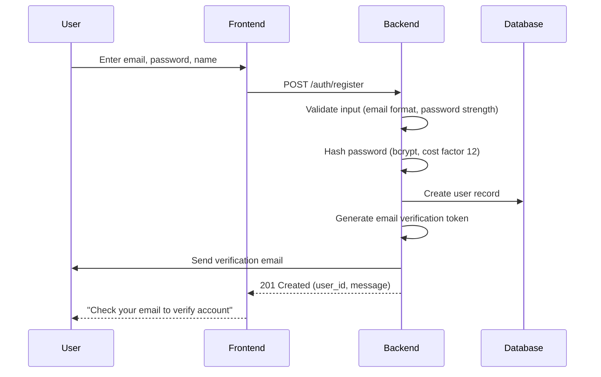
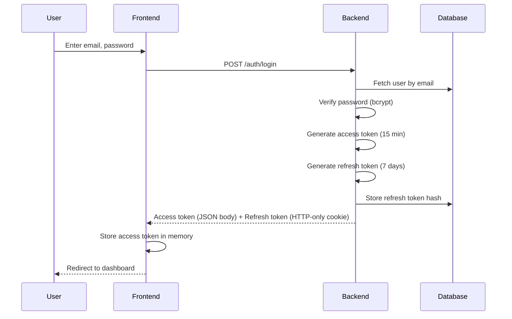

# Authentication & Authorization Design — Resume Tailor

## Overview
This document defines the authentication and authorization strategy for Resume Tailor. While the MVP currently operates without authentication, this design establishes the foundation for future multi-user support.

**Current Status:** MVP (no authentication)  
**Future Implementation:** Phase 2 (multi-user support)

---

## Phase 1: MVP (Current)

### No Authentication Required
- All API endpoints are publicly accessible
- Single-session usage assumed
- Data stored without user ownership
- **Rationale:** Faster MVP delivery, focus on core features

### Limitations
- No user accounts or profiles
- Cannot save multiple resumes per user
- No access control or data privacy
- Not suitable for production with real user data

---

## Phase 2: Multi-User Authentication (Planned)

### Authentication Strategy: JWT (JSON Web Tokens)

#### Token Types
1. **Access Token**
   - Short-lived (15 minutes)
   - Used for API authorization
   - Contains user ID, email, role
   - Stored in memory (frontend)

2. **Refresh Token**
   - Long-lived (7 days)
   - Used to obtain new access tokens
   - Stored in HTTP-only secure cookie
   - Rotated on each use

#### Token Payload (Access Token)
```json
{
  "sub": "user@example.com",
  "user_id": 123,
  "role": "user",
  "iat": 1714560000,
  "exp": 1714560900
}
```

---

## Authentication Flows

### 1. User Registration



**Endpoint:** `POST /auth/register`

**Request:**
```json
{
  "email": "user@example.com",
  "password": "SecurePass123!",
  "name": "John Doe"
}
```

**Response (201 Created):**
```json
{
  "user_id": 123,
  "message": "Registration successful. Please check your email to verify your account."
}
```

**Password Requirements:**
- Minimum 8 characters
- At least one uppercase letter
- At least one lowercase letter
- At least one number
- At least one special character
- Not in common password list (check against Have I Been Pwned database)

---

### 2. Email Verification

**Endpoint:** `GET /auth/verify-email?token=<verification_token>`

**Response (200 OK):**
```json
{
  "message": "Email verified successfully. You can now log in."
}
```

---

### 3. User Login



**Endpoint:** `POST /auth/login`

**Request:**
```json
{
  "email": "user@example.com",
  "password": "SecurePass123!"
}
```

**Response (200 OK):**
```json
{
  "access_token": "eyJhbGciOiJIUzI1NiIs...",
  "token_type": "Bearer",
  "expires_in": 900,
  "user": {
    "id": 123,
    "email": "user@example.com",
    "name": "John Doe",
    "role": "user"
  }
}
```

**Set-Cookie Header:**
```
refresh_token=<token>; Path=/; HttpOnly; Secure; SameSite=Strict; Max-Age=604800
```

**Error Responses:**

**401 Unauthorized** — Invalid credentials
```json
{
  "error_code": "INVALID_CREDENTIALS",
  "message": "Invalid email or password",
  "details": null
}
```

**403 Forbidden** — Email not verified
```json
{
  "error_code": "EMAIL_NOT_VERIFIED",
  "message": "Please verify your email before logging in",
  "details": null
}
```

---

### 4. Token Refresh

When access token expires, frontend automatically requests a new one using the refresh token.

**Endpoint:** `POST /auth/refresh`

**Request:**
- No body required
- Refresh token sent via HTTP-only cookie

**Response (200 OK):**
```json
{
  "access_token": "eyJhbGciOiJIUzI1NiIs...",
  "token_type": "Bearer",
  "expires_in": 900
}
```

**New refresh token** is issued and set in cookie (token rotation for security).

**Error Responses:**

**401 Unauthorized** — Invalid or expired refresh token
```json
{
  "error_code": "INVALID_REFRESH_TOKEN",
  "message": "Session expired. Please log in again.",
  "details": null
}
```

---

### 5. User Logout

**Endpoint:** `POST /auth/logout`

**Request:**
- Access token in Authorization header
- Refresh token in cookie

**Response (200 OK):**
```json
{
  "message": "Logged out successfully"
}
```

**Backend Actions:**
1. Invalidate refresh token in database
2. Clear refresh token cookie
3. Optionally: Add access token to blacklist (until expiry)

---

### 6. Password Reset

#### Step 1: Request Reset

**Endpoint:** `POST /auth/forgot-password`

**Request:**
```json
{
  "email": "user@example.com"
}
```

**Response (200 OK):**
```json
{
  "message": "If an account exists with this email, you will receive a password reset link."
}
```

**Note:** Always return success (even if email doesn't exist) to prevent email enumeration attacks.

#### Step 2: Reset Password

**Endpoint:** `POST /auth/reset-password`

**Request:**
```json
{
  "token": "<reset_token_from_email>",
  "new_password": "NewSecurePass456!"
}
```

**Response (200 OK):**
```json
{
  "message": "Password reset successful. You can now log in with your new password."
}
```

---

## Authorization

### Role-Based Access Control (RBAC)

#### Roles
1. **User (default)** — Standard user account
   - Can upload resumes and JDs
   - Can view own data only
   - Limited API rate: 100 requests/min

2. **Premium User** — Paid subscription
   - All User permissions
   - Higher rate limit: 1000 requests/min
   - Access to advanced features (ATS scoring, rewrite bullets)

3. **Admin** — System administrator
   - Can view all data
   - Can manage users
   - No rate limits
   - Access to admin dashboard

### Permission Model

| Endpoint | User | Premium | Admin |
|----------|------|---------|-------|
| POST /upload-resume/ | ✓ (own) | ✓ (own) | ✓ (all) |
| GET /resume/{id} | ✓ (own) | ✓ (own) | ✓ (all) |
| POST /gap-analysis/ | ✗ | ✓ | ✓ |
| POST /ats-score/ | ✗ | ✓ | ✓ |
| GET /admin/users | ✗ | ✗ | ✓ |

### Ownership Enforcement
All resume and JD records will have a `user_id` foreign key. API queries automatically filter by `user_id` extracted from JWT token:

```python
# Example: Get user's resumes only
def get_resumes(db: Session, user_id: int):
    return db.query(Resume).filter(Resume.user_id == user_id).all()
```

---

## Security Considerations

### Password Security
- **Hashing:** bcrypt with cost factor 12 (or Argon2)
- **Salting:** Automatic with bcrypt
- **No plaintext storage:** Passwords never logged or displayed
- **Password history:** Prevent reuse of last 5 passwords

### Token Security
- **Signing:** HMAC-SHA256 with strong secret key (256-bit random)
- **Secret rotation:** Quarterly secret key rotation with grace period
- **Token blacklist:** Store invalidated tokens in Redis (for logout, password change)
- **HTTPS only:** Tokens only transmitted over TLS 1.2+

### Session Management
- **Concurrent sessions:** Allow up to 3 active sessions per user
- **Session tracking:** Store active sessions in database
- **Force logout:** Admin can terminate user sessions
- **Inactivity timeout:** Refresh tokens expire after 7 days of inactivity

### Brute Force Protection
- **Rate limiting:** Max 5 login attempts per IP per 15 minutes
- **Account lockout:** Lock account after 10 failed attempts in 1 hour
- **CAPTCHA:** Show CAPTCHA after 3 failed attempts
- **Monitoring:** Alert on suspicious login patterns

### Multi-Factor Authentication (MFA) — Future
- **TOTP (Time-based OTP):** Support for apps like Google Authenticator
- **SMS/Email OTP:** Backup method
- **Recovery codes:** One-time backup codes for account recovery

---

## Database Schema Changes (Phase 2)

### New Table: `users`

| Column | Type | Constraints | Description |
|--------|------|-------------|-------------|
| `id` | INTEGER | PRIMARY KEY | User ID |
| `email` | VARCHAR(255) | UNIQUE, NOT NULL | User email (username) |
| `password_hash` | VARCHAR(255) | NOT NULL | bcrypt hashed password |
| `name` | VARCHAR(100) | NOT NULL | User full name |
| `role` | ENUM | DEFAULT 'user' | Role: user, premium, admin |
| `email_verified` | BOOLEAN | DEFAULT FALSE | Email verification status |
| `email_verification_token` | VARCHAR(255) | NULLABLE | Token for email verification |
| `last_login` | TIMESTAMP | NULLABLE | Last successful login |
| `failed_login_attempts` | INTEGER | DEFAULT 0 | Count of failed logins |
| `locked_until` | TIMESTAMP | NULLABLE | Account lock expiry |
| `created_at` | TIMESTAMP | DEFAULT NOW() | Account creation time |
| `updated_at` | TIMESTAMP | DEFAULT NOW() | Last update |

### New Table: `refresh_tokens`

| Column | Type | Constraints | Description |
|--------|------|-------------|-------------|
| `id` | INTEGER | PRIMARY KEY | Token ID |
| `user_id` | INTEGER | FOREIGN KEY → users.id | Token owner |
| `token_hash` | VARCHAR(255) | NOT NULL | SHA-256 hash of token |
| `expires_at` | TIMESTAMP | NOT NULL | Token expiry time |
| `revoked` | BOOLEAN | DEFAULT FALSE | Revocation status |
| `created_at` | TIMESTAMP | DEFAULT NOW() | Token creation time |

### Modified Tables

**`resumes` table:**
- Add `user_id` (INTEGER, FOREIGN KEY → users.id, NOT NULL)

**`job_descriptions` table:**
- Add `user_id` (INTEGER, FOREIGN KEY → users.id, NOT NULL)

---

## Implementation Checklist

### Backend (FastAPI)
- [ ] Install dependencies: `PyJWT`, `passlib[bcrypt]`, `python-multipart`
- [ ] Create `users` and `refresh_tokens` models
- [ ] Implement password hashing utilities
- [ ] Create JWT token generation/validation functions
- [ ] Implement authentication endpoints
- [ ] Add authentication middleware (dependency injection)
- [ ] Update existing endpoints to require authentication
- [ ] Add user_id filtering to CRUD operations
- [ ] Implement rate limiting
- [ ] Add email service integration (SendGrid/AWS SES)

### Frontend
- [ ] Create login/registration forms
- [ ] Implement token storage (memory + HTTP-only cookie)
- [ ] Add Authorization header to all API calls
- [ ] Implement automatic token refresh
- [ ] Handle 401 errors (redirect to login)
- [ ] Create user profile page
- [ ] Add logout functionality

### Database
- [ ] Create migration for users and refresh_tokens tables
- [ ] Add user_id columns to resumes and job_descriptions
- [ ] Create indexes on user_id columns
- [ ] Migrate existing data (assign to default user)

---

## Testing Strategy

### Unit Tests
- Password hashing and verification
- Token generation and validation
- Password strength validation
- Email format validation

### Integration Tests
- Full registration flow
- Login with valid/invalid credentials
- Token refresh mechanism
- Logout and token invalidation
- Password reset flow

### Security Tests
- Brute force protection
- Token expiry enforcement
- Authorization (access own data only)
- SQL injection prevention
- XSS prevention in error messages

---

*Last Updated: May 1, 2026*  
*Document Version: 1.0*  
*Status: Design Phase (Not Yet Implemented)*