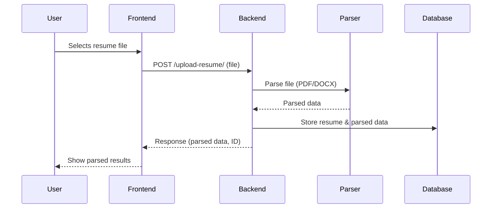

# Data Flow & Integration Diagrams — Resume Tailor

## Overview
This document provides visual and textual representations of the data flow and system integration points for Resume Tailor. It covers how data moves between frontend, backend, database, and external services.

---

## 1. High-Level System Architecture

```mermaid
graph TD
    A[User (Browser)] -->|Uploads Resume/JD| B(Frontend UI)
    B -->|Sends file| C(FastAPI Backend)
    C -->|Parses file| D[Parser Modules]
    D -->|Extracted Data| C
    C -->|Stores| E[(PostgreSQL DB)]
    C -->|Returns parsed data| B
    B -->|Displays results| A
```

---

## 2. Sequence: Resume Upload & Parsing



---

## 3. Integration Points
- **Frontend ↔ Backend:** REST API (file upload, data retrieval)
- **Backend ↔ Database:** SQLAlchemy ORM (CRUD operations)
- **Backend ↔ Parser Modules:** Internal Python modules (pdfplumber, python-docx, PyMuPDF)
- **Future:**
  - External ATS scoring API
  - Email notification service

---
*This document will be updated as new integrations and flows are added.*
